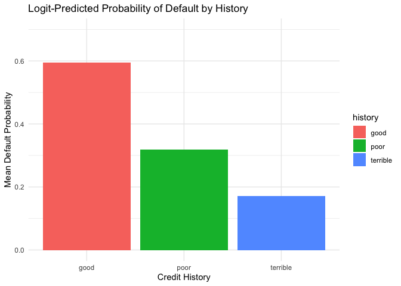

## Saratoga house prices

Return to the data set on house prices in Saratoga, NY that we
considered in class. Recall that a starter script here is in
`saratoga_lm.R`. For this data set, you’ll run a “horse race” (i.e. a
model comparison exercise) between two model classes: linear models and
KNN.

-   Build the best linear model for price that you can. It should
    clearly outperform the “medium” model that we considered in class.
    Use any combination of transformations, engineering features,
    polynomial terms, and interactions that you want; and use any
    strategy for selecting the model that you want.  
-   Now build the best K-nearest-neighbor regression model for price
    that you can. Note: you still need to choose which features should
    go into a KNN model, but you don’t explicitly include interactions
    or polynomial terms. The method is sufficiently adaptable to find
    interactions and nonlinearities, if they are there. But do make sure
    to *standardize* your variables before applying KNN, or at least do
    something that accounts for the large differences in scale across
    the different variables here.

Which model seems to do better at achieving lower out-of-sample
mean-squared error? Write a report on your findings as if you were
describing your price-modeling strategies for a local taxing authority,
who needs to form predicted market values for properties in order to
know how much to tax them. Keep the main focus on the conclusions and
model performance; any relevant technical details should be put in an
appendix.

Note: When measuring out-of-sample performance, there is *random
variation* due to the particular choice of data points that end up in
your train/test split. Make sure your script addresses this by averaging
the estimate of out-of-sample RMSE over many different random train/test
splits, either randomly or by cross-validation.

## Classification and retrospective sampling

*Make a bar plot of default probability by credit history, and build a
logistic regression model for predicting default probability, using the
variables
`duration + amount + installment + age + history + purpose + foreign`.*

*What do you notice about the `history` variable vis-a-vis predicting
defaults? What do you think is going on here? In light of what you see
here, do you think this data set is appropriate for building a
predictive model of defaults, if the purpose of the model is to screen
prospective borrowers to classify them into “high” versus “low”
probability of default? Why or why not—and if not, would you recommend
any changes to the bank’s sampling scheme?*

In this visualization we see higher predicted probabilities of default
for individuals with good credit vs those with terrible credit. This
counter-intuitive result is likely caused by our dubious sampling method
that “matches each default with similar sets of loans that had not
defaulted, including all reasonably close matches in the analysis.”

The problem here is that we are conditioning on defaulted loans and thus
creating a biased sample. The matching loans associated with *history*
== “good” may have other characteristics which are not as often
associated with default, and so our model may distiguish *historygood*
as the feature which best explains variation in *Default*. For this
reason, this data set is inappropriate for building a model to screen
prospective borrowers for default risk. Random sampling would eliminate
this issue because there would be a much larger number of loans with
*historygood* & *default* == 0, and so other, less-biased relationships
might emerge.

## Children and hotel reservations

The files `hotels_dev.csv` and `hotels_val.csv` contains data on tens of
thousands of hotel stays from a major U.S.-based hotel chain. The goal
of this problem is simple: to build a predictive model for whether a
hotel booking will have children on it.

Why would that be important? For an equally simple reason: when booking
a hotel stay on a website, parents often enter the reservation
exclusively for themselves and forget to include their children on the
form. Obviously, the hotel isn’t going to turn parents away from their
room if they neglected to mention that their children would be staying
with them. But **not** knowing about those children does, at least in
the aggregate, prevent the hotel from making accurate forecasts of
resource utilization. So if, for example, you could use the *other*
features associated with a booking to forecast that a bunch of kids were
going to show up unannounced, you might know to order more chicken
nuggets for the restaurant and less tequila for the bar. (Or maybe more
tequila, depending on how frazzled the parents who stay at your hotel
tend to be.) In any event, as a hotel operator, if you can forecast the
arrival of those kids a bit better, you can be just a bit more
efficient, operationally speaking. This is an excellent use case for an
ML model: a piece of software that can scan the bookings for the week
ahead and produce an estimate for how likely each one is to have a
“hidden” child on it.

The target variable of interest is `children`: a dummy variable for
whether the booking has children on it. All other variables in the data
set can be used to predict the `children` variable, and the names are
pretty self-explanatory.

### Model building

Using only the data in `hotels.dev.csv`, please compare the
out-of-sample performance of the following models:

1.  baseline 1: a small model that uses only the `market_segment`,
    `adults`, `customer_type`, and `is_repeated_guest` variables as
    features.  
2.  baseline 2: a big model that uses all the possible predictors
    *except* the `arrival_date` variable (main effects only).  
3.  the best linear model you can build, including any engineered
    features that you can think of that improve the performance
    (interactions, features derived from time stamps, etc).

Use the `hotels_dev.csv` file for your **entire** model building and
testing pipeline. That is, you’ll create your train/test splits using
`hotels_dev` only, and not testing at all on `hotels_val`. Everything in
`hotels_val` should be held back for the next part of this exercise.

Note: you can measure out-of-sample performance in any reasonable way
that we’ve talked about in class or that you’ve encountered in the
reading, as long as you are clear how you’re doing it.

### Model validation: step 1

Once you’ve built your best model and assessed its out-of-sample
performance using `hotels_dev`, now turn to the data in `hotels_val`.
Now you’ll **validate** your model using this entirely fresh subset of
the data, i.e. one that wasn’t used to fit OR test as part of the
model-building stage. (Using a separate “validation” set, completely
apart from your training and testing set, is a generally accepted best
practice in machine learning.)

Produce an ROC curve for your best model, using the data in
`hotels_val`: that is, plot TPR(t) versus FPR(t) as you vary the
classification threshold t.

### Model validation: step 2

Next, create 20 folds of `hotels_val`. There are 4,999 bookings in
`hotels_val`, so each fold will have about 250 bookings in it – roughly
the number of bookings the hotel might have on a single busy weekend.
For each fold:

1.  Predict whether each booking will have children on it.  
2.  Sum up the predicted probabilities for all the bookings in the fold.
    This gives an estimate of the expected number of bookings with
    children for that fold.  
3.  Compare this “expected” number of bookings with children versus the
    actual number of bookings with children in that fold.

How well does your model do at predicting the total number of bookings
with children in a group of 250 bookings? Summarize this performance
across all 20 folds of the `val` set in an appropriate figure or table.
