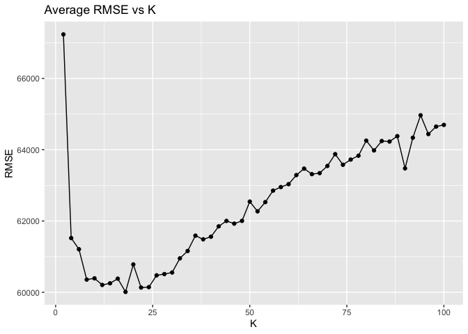
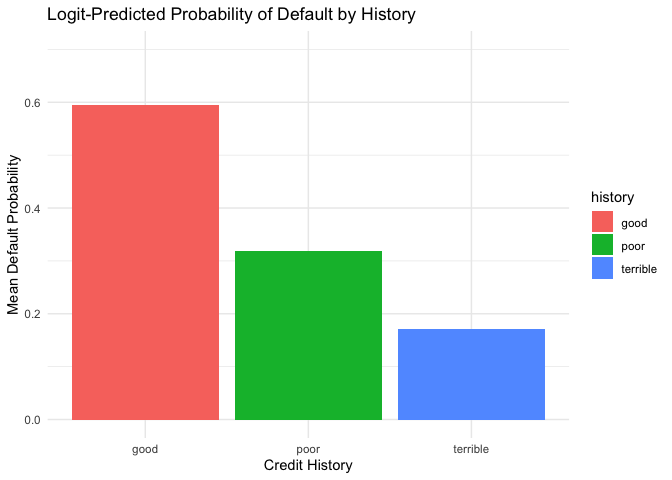
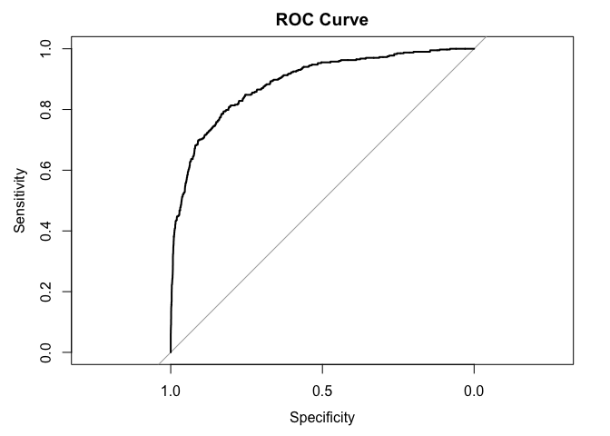
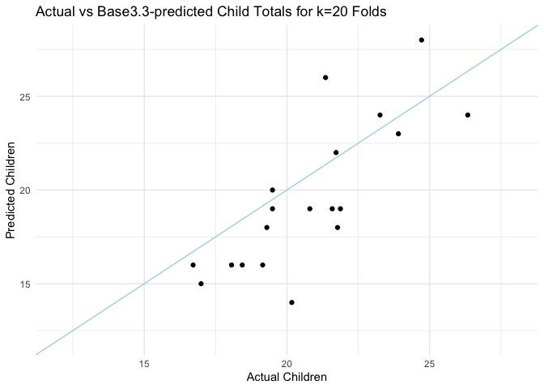
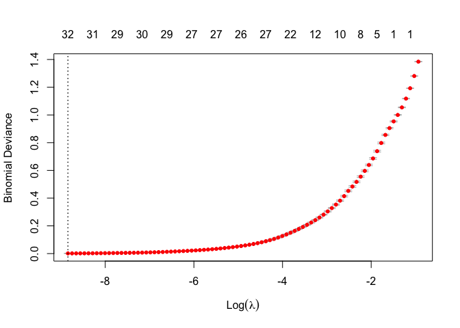
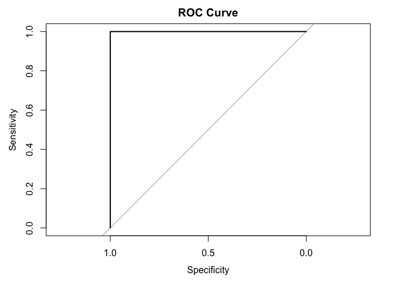

## Saratoga house prices

*Return to the data set on house prices in Saratoga, NY that we
considered in class. Recall that a starter script here is in
`saratoga_lm.R`. For this data set, you’ll run a “horse race” (i.e. a
model comparison exercise) between two model classes: linear models and
KNN.*

*- Build the best linear model for price that you can. It should clearly
outperform the “medium” model that we considered in class. Use any
combination of transformations, engineering features, polynomial terms,
and interactions that you want; and use any strategy for selecting the
model that you want. *

Before fitting data to models, we first standardized all the data except
price. Now all variables have same predictive effect on price. We first
fit the data with the ‘medium’ model. The baseline out-of-sample RMSE is
58914.447. Then we explore relavent interaction and square terms by
coding feature matrices and running Lasso and Ridge models.

Lasso model predicts important variables as: `price` ~ `landsize` +
`landvalue` + `livingArea` + `bathrooms` + `waterfront` + `centralAir` +
`waterfront^2` + `centralAir^2` + `landValue:newConstruction` +
`livingArea:centralAir` + `bathrooms:centralAir`.

Ridge suggests that `landvalue`, `livingArea`, `bathrooms`, `rooms`,
`centralAir^2` and `waterfront:newConstruction` are most effective.

Out-of-sample RMSEs for both Lasso and Ridge are higher than baseline.
We combine features identified by both in the following linear model.

    ## RSME for linear model is 57998.4545691018

In summary, we used terms yielded by Lasso and Ridge regression to
identify a stronger linear model than the medium.

*- Now build the best K-nearest-neighbor regression model for price that
you can. Note: you still need to choose which features should go into a
KNN model, but you don’t explicitly include interactions or polynomial
terms. The method is sufficiently adaptable to find interactions and
nonlinearities, if they are there. But do make sure to *standardize*
your variables before applying KNN, or at least do something that
accounts for the large differences in scale across the different
variables here. *

For the KNN model, we use lasso model to do the feature selection for
us. We assuming that features that are more important in Lasso also make
sense in KNN model. We choose `lotSize`, `landValue`, `livingArea`,
`bathrooms`, `rooms`, `waterfront`, `newConstruction` and `centralAir`
to fit the KNN model. Under CV, we choose the optimal k equal to 18.
However, KNN model performs worse in out-of-sample RMSE than the medium
and improved linear models. All RSME’s reported are cross-validated
averages.

    ## 16 x 1 sparse Matrix of class "dgCMatrix"
    ##                          s1
    ## (Intercept)     211966.7054
    ## lotSize            756.0515
    ## age                  .     
    ## landValue        28495.4134
    ## livingArea       41446.5524
    ## pctCollege           .     
    ## bedrooms             .     
    ## fireplaces           .     
    ## bathrooms        13686.6243
    ## rooms              651.9639
    ## heating              .     
    ## fuel                 .     
    ## sewer                .     
    ## waterfront       -6720.0651
    ## newConstruction    602.8506
    ## centralAir       -4137.4687

## Classification and retrospective sampling

*Make a bar plot of default probability by credit history, and build a
logistic regression model for predicting default probability, using the
variables
`duration + amount + installment + age + history + purpose + foreign`.*

*What do you notice about the `history` variable vis-a-vis predicting
defaults? What do you think is going on here? In light of what you see
here, do you think this data set is appropriate for building a
predictive model of defaults, if the purpose of the model is to screen
prospective borrowers to classify them into “high” versus “low”
probability of default? Why or why not—and if not, would you recommend
any changes to the bank’s sampling scheme?*

In this visualization we see higher predicted probabilities of default
for individuals with good credit vs those with terrible credit. This
counter-intuitive result is likely caused by our dubious sampling method
that “matches each default with similar sets of loans that had not
defaulted, including all reasonably close matches in the analysis.”

The problem here is that we are conditioning on defaulted loans and thus
creating a biased sample. The matching loans associated with `history`
== “good” may have other characteristics which are not as often
associated with default, and so our model may distinguish `historygood`
as the feature which best explains variation in `Default`. For this
reason, this data set is inappropriate for building a model to screen
prospective borrowers for default risk. Random sampling would eliminate
this issue because there would be a much larger number of loans with
`historygood` == 1 & `Default` == 0, and so other, less-biased
relationships might emerge.

## Children and hotel reservations

*The files `hotels_dev.csv` and `hotels_val.csv` contains data on tens
of thousands of hotel stays from a major U.S.-based hotel chain. The
goal of this problem is simple: to build a predictive model for whether
a hotel booking will have children on it. This is an excellent use case
for an ML model: a piece of software that can scan the bookings for the
week ahead and produce an estimate for how likely each one is to have a
“hidden” child on it.*

### Model building

*Using only the data in `hotels.dev.csv`, please compare the
out-of-sample performance of the following models:*

1.  *baseline 1: a small model that uses only the `market_segment`,
    `adults`, `customer_type`, and `is_repeated_guest` variables as
    features.*

For baseline 1 we used a linear model using the lm function in R. We
then ran k-fold validation with k=10 and calculated the mean RMSE
\[below\].

    ## base1 RMSE: 0.2684

1.  *baseline 2: a big model that uses all the possible predictors
    *except* the `arrival_date` variable (main effects only).* Same
    approach as \[above\] with marginal gains.

<!-- -->

    ## base2 RMSE: 0.2331

1.  *the best linear model you can build, including any engineered
    features that you can think of that improve the performance
    (interactions, features derived from time stamps, etc).*

I tested various linear models and arrived at base3.3 which is base2
with the following additional terms:

-   `poly(adults, 2)`
-   `poly(total_of_special_requests, 2)`
-   `required_car_parking_spaces:poly(adults, 2)`
-   `reserved_room_type:customer_type`
-   `reserved_room_type:average_daily_rate`
-   `reserved_room_type:meal`
-   `reserved_room_type:stays_in_weekend_nights`
-   `reserved_room_type:hotel`
-   `hotel:stays_in_weekend_nights`

NOTE: base3.4 includes these terms + `arrival_date` which has been
re-coded to eliminate “yyyy” so to capture a day-of-the-year effect. We
see that base3.4 is more significant but only improves RSME by a
fraction of percentage at the expense of adding hundreds of variables.
Thus, we will move forward with base 3.3.

    ## base3.3 RMSE: 0.2249

### Model validation: step 1

*Once you’ve built your best model and assessed its out-of-sample
performance using `hotels_dev`, now turn to the data in `hotels_val`.
Now you’ll **validate** your model using this entirely fresh subset of
the data, i.e. one that wasn’t used to fit OR test as part of the
model-building stage. (Using a separate “validation” set, completely
apart from your training and testing set, is a generally accepted best
practice in machine learning.) *

*Produce an ROC curve for your best model, using the data in
`hotels_val`: that is, plot TPR(t) versus FPR(t) as you vary the
classification threshold t.*

See below confusion matrix and ROC curve, where ‘Sensitivity’ = TPR and
Specificity = 1-FPR.

    ##    yhat
    ## y      0    1
    ##   0 4540   57
    ##   1  241  161

### Model validation: step 2

*Next, create 20 folds of `hotels_val`. There are 4,999 bookings in
`hotels_val`, so each fold will have about 250 bookings in it – roughly
the number of bookings the hotel might have on a single busy weekend.
For each fold:*

*1. Predict whether each booking will have children on it. * *2. Sum up
the predicted probabilities for all the bookings in the fold. This gives
an estimate of the expected number of bookings with children for that
fold. * *3. Compare this “expected” number of bookings with children
versus the actual number of bookings with children in that fold.*

*How well does your model do at predicting the total number of bookings
with children in a group of 250 bookings? Summarize this performance
across all 20 folds of the `val` set in an appropriate figure or table.
*

Seen above, our model does an pretty awesome job of predicting whether
or not there will be children at the booking. We are often within 5
children off from actual, and we are about as often higher than actual
than lower. This will give the hotel a good idea of how many kiddos to
expect.

## Mushroom classification

*The data in [mushrooms.csv](../data/mushrooms.csv) correspond to 23
species of gilled mushrooms in the Agaricus and Lepiota Family. Each
species is identified as definitely edible (class = e), definitely
poisonous (class = p), or of unknown edibility and not recommended.
(This latter class was combined with the poisonous one.) There is no
simple rule for determining the edibility of a mushroom, analogous to
“leaves of three, let it be” for poison ivy.*

*The features in the data set are as follows \[see assignment\]*

*So you can see that all of the variables are categorical, sometimes
with more than 2 levels.*

*Can you predict whether a mushroom is poisonous using machine learning?
Write a short report on the best-performing model you can find using
lasso-penalized logistic regression. Evaluate the out-of-sample
performance of your model using a ROC curve. Based on this ROC curve,
recommend a probability threshold for declaring a mushroom poisonous.
How well does your model perform at this threshold, as measured by false
positive rate and true positive rate?*

    ## Ideal Lambda: 0.0001444448

Using the lasso-penalized logistic regression model, we get the graph
depicted above which shows the relationship between log lambda and
binomial deviance. The lambda that minimizes deviance is approximately
0.0001444448. We can use this value to evaluate the out-of-sample
performance of our model through a ROC curve.

In this case, the ROC curve does not resemble the typical curve but
rather mirrors the shape of a right triangle. This sort of configuration
indicates that the lasso-penalized logistic regression model has
exceptional classification accuracy. This is because a right triangle
shape suggests a model characterized by both high sensitivity and high
specificity.

    ##   threshold sensitivity specificity
    ## 1 0.5017094           1           1

    ## FPR 0

    ## TPR 1

Based on the ROC curve I would recommend a probability threshold of
0.5017094. Since we have a false positive rate of 0 and a true positive
of 1, it is safe to say that our model performs exceptionally well at
this threshold. To be certain that this exceptional performance is not a
product of overfitting, we could test our model on an external dataset
to see if it performs similarly. In conclusion, we are able to predict
that poisonous mushrooms ARE INDEED poisonous 100% of the time.
