# ECO 395M: StatLearning Exercise 3
#### Joseph Williams, Aahil Navroz, Qi Suqian
#### 04/01/2023

## What causes what?

*1. Why can’t I just get data from a few different cities and run the
regression of “Crime” on “Police” to understand how more cops in the
streets affect crime? (“Crime” refers to some measure of crime rate and
“Police” measures the number of cops in a city.)*

Selection bias! Some cities have more police because of more crime and
other confounding factors!

*2. How were the researchers from UPenn able to isolate this effect?
Briefly describe their approach and discuss their result in the “Table
2” below, from the researchers’ paper.*

<figure>
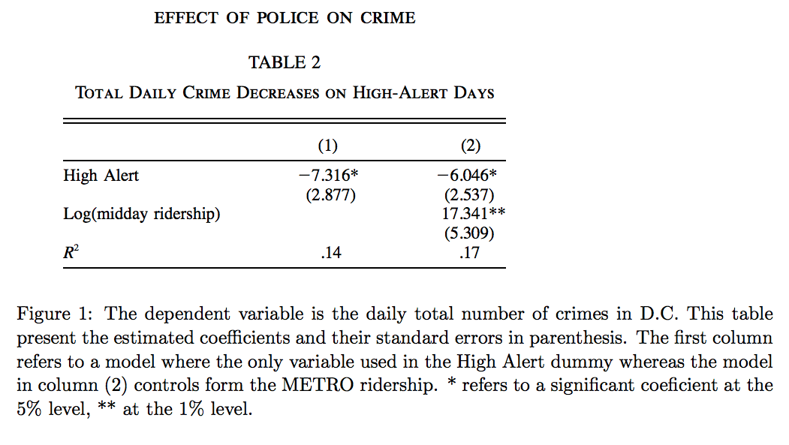
<figcaption aria-hidden="true">Table 2</figcaption>
</figure>

The researchers were able to isolate this effect through a natural
experiment by observing changing in crime rate between ‘terrorist
threat’ days and normal days. The intuition here is that terrorism
threat status should be independent of day-to-day factors causing crime
but WILL increase police presence in the city. In table2, we see the
results on the experiment: that an increased police presence accounts
for a decrease of ~6-7 crimes in the city, a result which is
statistically significant at the .05 level.

*3. Why did they have to control for Metro ridership? What was that
trying to capture?*

Here, metro ridership is presented as a proxy for foot-traffic in the
city. In the regression above, `Log(midday ridership)` is offered as an
omitted variable able to explain variation between crime rate and
terrorist threat status. However, the `High Alert` value and
significance is relatively unchanged with the addition of
`Log(midday ridership)`, so we can conclude that variation in crime is
likely caused by police presence and not by differences in pedestrian
behavior.

*4. Below I am showing you “Table 4” from the researchers’ paper. Just
focus on the first column of the table. Can you describe the model being
estimated here? What is the conclusion?*

Here, the authors partition their data to distinguish between district 1
and all other districts. District 1 is a district of high government
importance, and non-patrolling officers from across the city are
directed here during periods of high alert. Our conclusion from the
regression is that the majority of decline in crime during high alert
periods is located in district 1, and that decreases in other parts of
the city are not statistically significant. This aligns with the
findings of the paper, since increase of police presence will be
dedicated towards district 1, we expect this is where decrease of crime
should occur IF more police -&gt; less crime.

## Tree modeling: dengue cases

*Your task is to use *CART*, *random forests*, and *gradient-boosted
trees* to predict dengue cases (or log dengue cases – your choice, just
explain) based on the features available in the data set. As we usually
do, hold out some of the data as a testing set to quantify the
performance of these models. (That is, any cross validation should be
done *only* on the training data, with the testing data held as a final
check to compare your best CART model vs. your best random forest model
vs. your best boosted tree model.) Then, for whichever model has the
better performance on the testing data, make three partial dependence
plots:*

We first impute the data with KNN method and scale all variables except
the dependent one.

Now we train the CART model with the training data and select the best
parameters. Since the sample size is not big, we choose the default
minsplit and use cv to choose the best cp.

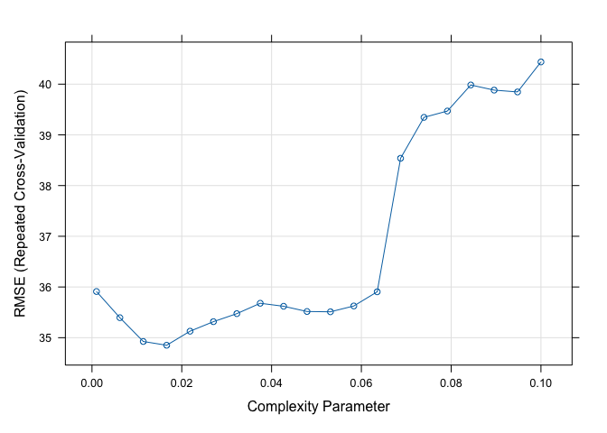

From the plot, we choose cp to be 0.011 according to minimium criterion.
Then we move to the random forest model. We choose the number of
bootstrapped sample to be 2000 to avoid selection for n.trees. number of
features is chosen using OOB method.

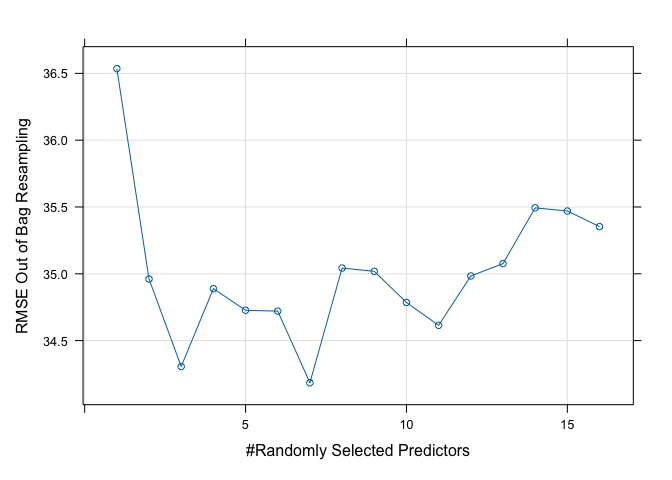

From the plot, we choose mtry to be 5 according to the minimum
criterion.

Next, we consider the Gradient Boosting Decision Tree model (GBDT). Once
again, we choose a large number of trees to avoid selection for n.trees.
In addition to the standard choice of gaussian distribution, we choose a
poisson distribution for y since the outcome total\_cases is a sum of
count. Next we choose the interaction.depth and shrinkage by CV. We
choose the default value for n.minobsinnode as 10 due to the small
sample size, and because we don’t want each tree to go too deep which
may lead to overfitting. (Here, the selection may take a long time. You
can can just run the last two command)

From our tuning result, for gaussian model, depth is 7 and shrinkage
rate is 0.01; for poisson model, depth is 8 and shrinkage rate is 0.005.
Then we use the test data to measure the performance for all these four
models by RMSE.

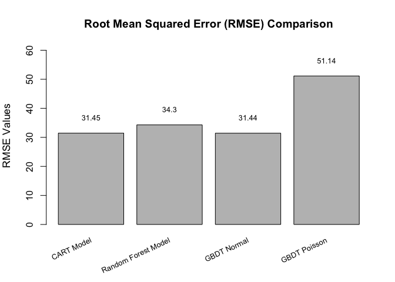 

The plot shows our GBDT Normal model has the lowest RMSE. We finish by
making 3 partial dependence plots for the model: specific\_humidity,
precipitation\_amt and tdtr\_k.

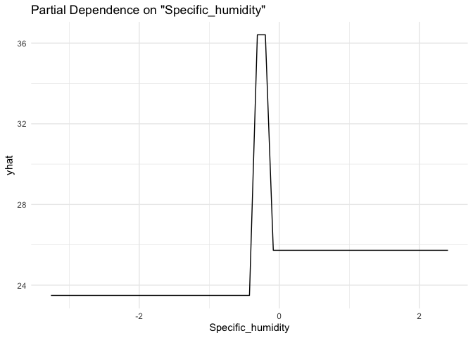

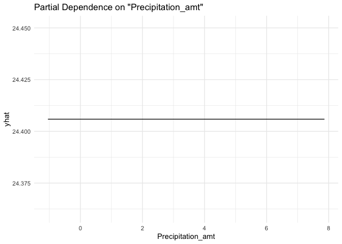

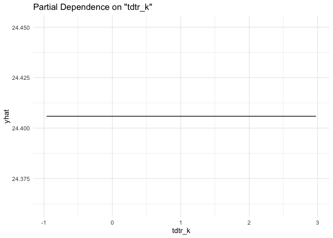

## Predictive model building: green certification

*Your goal is to build the best predictive model possible for *revenue
per square foot per calendar year*, and to use this model to quantify
the average change in rental income per square foot (whether in absolute
or percentage terms) associated with green certification, holding other
features of the building constant. (This might entail, for example, a
partial dependence plot, depending on what model you work with here.)
Note that revenue per square foot per year is the product of two terms:
`rent` and `leasing_rate`! This reflects the fact that, for example,
high-rent buildings with low occupancy may not actually bring in as much
revenue as lower-rent buildings with higher occupancy.*

First, we build all of standard models with limited feature engineering
and see which one does best out of the box! The feature engineering we
did perform is excluding non-predictive columns as well as rent and
lease rate to remove redundancy. We also remove any missing values and
scale all features. The models constructed are: - linear regression -
stepwise - lasso - KNN - descision tree - random forest - GBM - XGBoost

We compare these models by creating an 80% train/test split and forming
predictions on the ‘test’ data set using above models trained using the
‘train’ data set. For KNN and Lasso, we used CV to estimate optimal
k/lambda. We then calculate RSME for each model:

<figure>
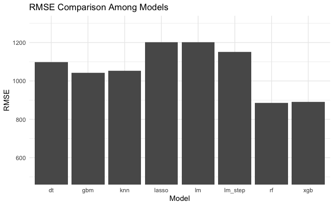
<figcaption aria-hidden="true">Table 4</figcaption>
</figure>

We see that, unsurprisingly, gbm, random forest and xgboost do the best
out of box. We now turn to tuning those models to determine which is
best. We use intuition and cross validation to tune each tree model. For
xgboost, we increase to `max_depth = 8` to make the the model more
complex and increase number of trees to `nrounds = 10000` to improve
performance. Our final model is xgboost.

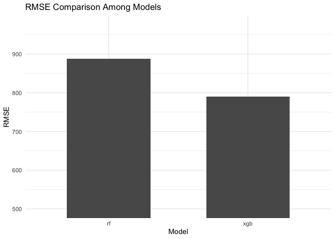

    ## xgboost rsme: 813.0357

In order to answer our principal question of whether or not a ‘green
rating’ has a significant effect on building revenue we calculate a
partial dependence plot for `green\_rating` vs predicted revenue/sqft/yr 
using the pdp package. Note that since we scaled the
features earlier, the green rating goes from -0.3083384 to 3.2427753
instead of 0 to 1. Buildings with green certification (a green rating of
1, which scaled to approximately 3.243) are predicted to generate more
revenue per square foot than non-green certified buildings (a green
rating of 0, which scaled to approximately -0.308).

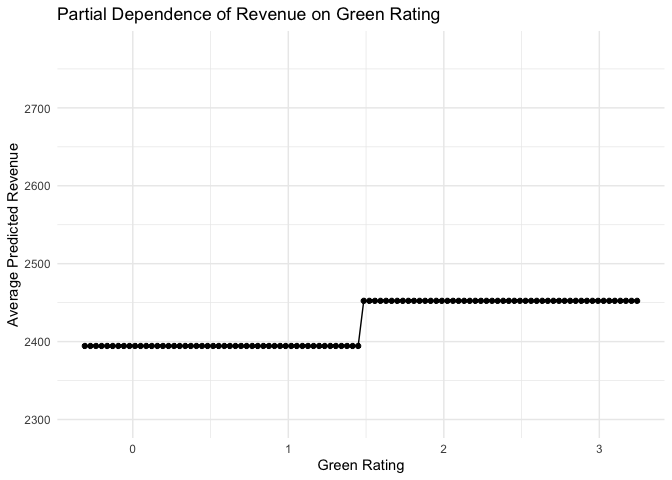

As shown, the categorical shift from `green\_rating == 0` to `green\_rating
== 1` corresponds to roughly $100 of predicted revenue per sqft, all else
held constant. Lets compare to the actual difference in revenue/sqft/yr,
where other characteristics are not held constant.

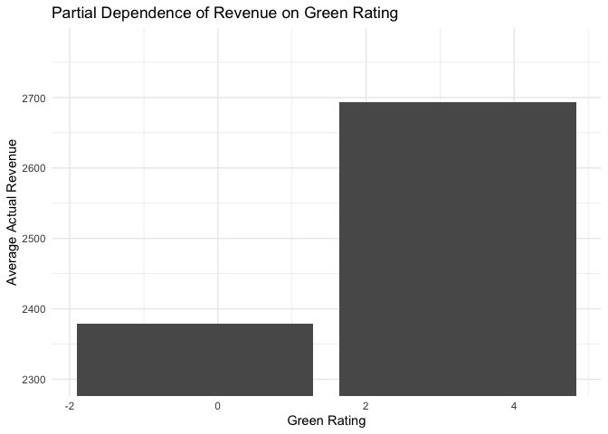

Indeed, here we can see on the same scale of axis that green buildings
are much more profitable when we do not take underlying characteristics
into consideration. This is doubtless due to the fact that buildings
with `green\_ratings == 1` are more likely to be nicer overall! Our chosen
model, however, is able to parse out a far more accurate revenue
increase of LEED or EnergyStar certifications as $100 revenue/sqft/yr.

## Predictive model building: California housing

*Your task is to build the best predictive model you can for
`medianHouseValue`, using the other available features. Write a short
report detailing your methods. Make sure your report includes an
estimate for the overall out-of-sample accuracy of your proposed model.
Also include three figures: - a plot of the original data, a plot of your 
model’s predictions, and a plot of your model’s errors/residuals.*

We first scale all data except the dependent variable and split the
sample into train set and test set. Similar to last problem, we tried 6
models to predict the value for the median house value: a baseline
linear model, lasso model with 2nd order interaction terms, Random
Forest model, GBDT model and XGBoost model. We first run the linear
models.

Then we look at Random forest model. We use 1000 trees and choose mtry
as default.

Next, we explore the 2 boosted tree models: GBDT and XGBoost. Starting
with GBDT, we use CV to select the best interaction depth and shrinkage
rate. We set the n.trees as 1000 since we think it’s sufficient large
and we set the distribution as gaussian. Since the sample size is small,
we set the n.minobsinnode to be 10.

Moving onto the XGBoost model, we choose the 3 best
parameters using cross validation: max\_depth, subsample and eta. 
After the cv selection, we run a loop through common parameter options 
to determine ‘best parameters’: max\_depth = 6 and nrounds = 10000.

Finally, we compare the out-of-sample performance for all 5 models. The
plot shows our XGBoost model have the lowest RMSE.  Therefore, we use
that model for prediction and to compile requested figures, below!

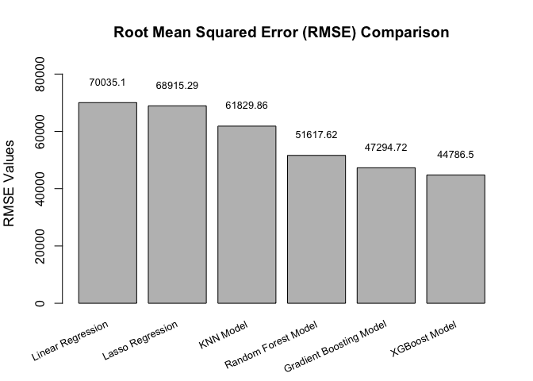

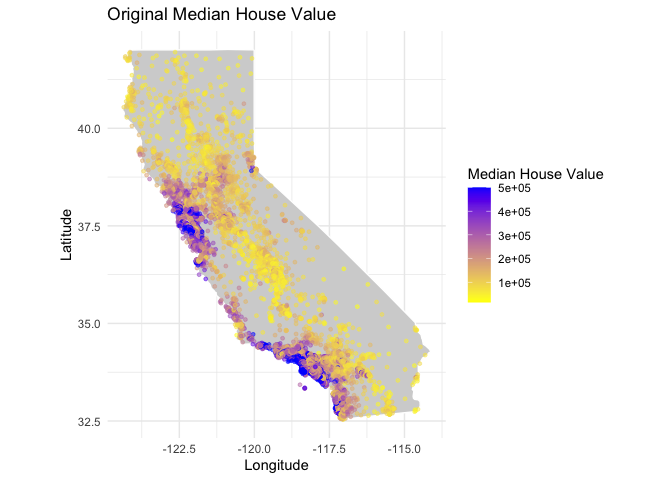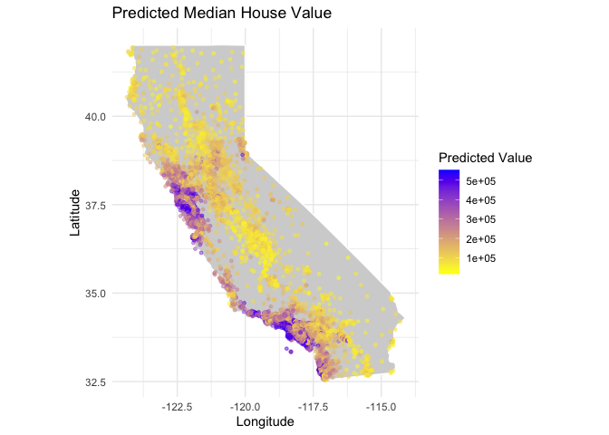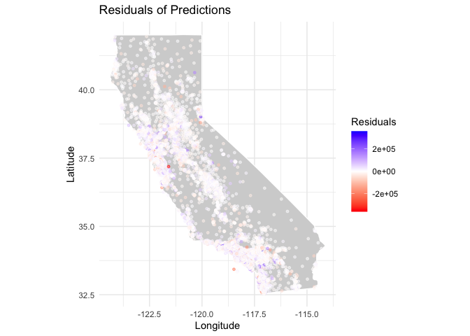

Our model does very well!  We are able to predict both the low housing prices of the interior and the high housing prices of the coastal region with very few outliers.
