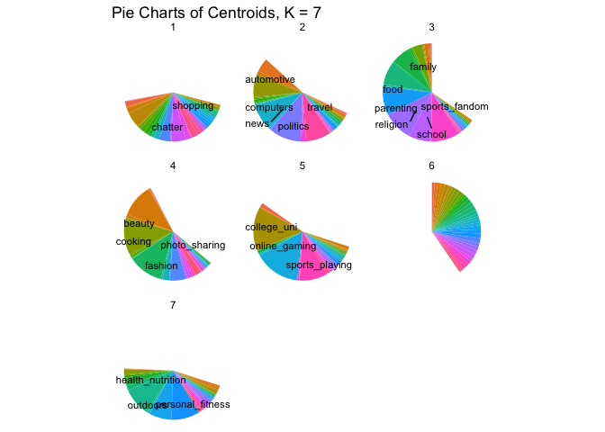

# ECO 395M: StatLearning Exercise 3

Aahil Navroz, Joseph Williams, Qi Suqian

04/22/2023

## Clustering and PCA

## Market segmentation

*Use the data to come up with some interesting, well-supported insights
about the audience and give your client some insight as to how they
might position their brand to maximally appeal to each market segment.*

To get a basic idea of our data lets start with a two-way correlation
plot.

Great! So already we’re seeing some clusters. I notice see two way
correlation within the following groups:

-   group1\_familyvalues: `parenting`, `religion`, `sports_fandom`,
    `food`, `school`, `family`
-   group2\_collegeboy: `college_uni`, `online_gaming`, `sports_playing`
-   group3\_fashionable: `beauty`, `cooking`, `fashion`
-   group4\_yuppie: `personal_fitness`, `health_nutrition`, `outdoors`
-   group5\_neolib: `politics`, `travel`, `computers`
-   group6\_socialyte: `shopping`, `chatter`, `photo_sharing`

Lets organize counts to see how many followers had at least two or more
tweets in at least 2, (or 3 for family\_values and socialyte) variables
of each cluster. Lets also filter out users who are in more than 3 of
these respective groups to eliminate generalists and get a better
personality portrait of our followers.

Over 1500 users are in the loosely constructed \`familyvalues’,
‘yuppie’, and ‘socialyte’ groups, respectively. Even with filtering
efforts, however, many users are likely counted 2 or even 3 times.
Before we go farther in this direction, lets shift to machine learning
algorithms so that our clusters are definite and exhaustive. We’ll start
with K-means and K\_means++ clustering with K=5-7 clusters, since we see
6 key groups off the bat. See below visualizations and counts per
cluster.

    ##   Cluster Users
    ## 1       1   740
    ## 2       2   670
    ## 3       3  4172
    ## 4       4   870
    ## 5       5  1430

    ##   Cluster Users
    ## 1       1  1280
    ## 2       2   620
    ## 3       3   706
    ## 4       4   517
    ## 5       5   371
    ## 6       6  3583
    ## 7       7   805

    ##   Cluster Users
    ## 1       1   682
    ## 2       2   888
    ## 3       3   574
    ## 4       4  4545
    ## 5       5   764
    ## 6       6   429

We are able to confirm using unsupervised learning pretty much the same
clusters we identified using intuition and basic tools. Labeled
variables have centroid values over a certain, relatively-high
threshold. Our results use standard K-means but we’ve verified that
results are repeatable with K-means++ start up. Regarding selection of K
we notice the following points:

-   Each K identifies a ‘spam’ category where no variables are dominant.
-   K=5 splits up our ‘fashionable’ and ‘socialyte’ clusters between the
    four non-spam groups, so that the only major feature of one of the
    clusters is `photo_sharing`.  
-   K=6,7 recovers the ‘fashionable’ cluster, and some of the
    ‘socialyte’ cluster. Its likely that the ‘socialyte’ characteristics
    `shopping`, `chatter` and `photo sharing` represent popular uses of
    Twitter which are more easily distributed between users in other
    categories.

Altogether, its clear that K=6 weeds out the most spam posts and
maintains an even distribution between the other categories, a key
requirement of clustering. Most importantly, it aligns with our
intuition. Next, our key insights will rely on K-means clustering using
K=6 and identify five distinct non-spam groups.

##### Insights & Recommended Steps

We’ve identified 5 roughly even-sized market segments. Here are the two
largest in descending order:

-   **Health-conscious adults (likely mid-twenties to thirties)**. In my
    city we call these yoga enthusiasts and REI shoppers ‘yuppies’,
    short for ‘young professionals’. This market segment shared twitter
    engagement in `health_nutrition`, `personal_fitness`, `outdoors`.
    This segment also showed notable interest for `eco`, though it did
    not meet the display threshold. We recommend an approach that shows
    sustainability efforts, and connects your product to outdoor
    engagement and mental health.

-   **Traditional Americans**. Don’t forget about the heartland, the
    silent majority, your minivan moms and sports bar dads. This market
    segment showed over-threshold engagement with more categories than
    any other group, by far, indicating they are ‘classic American’
    consumers- not part of any niche group. Key characteristics align
    with traditional values, and include `family`, `food`, `religion`,
    `sports fandom`, `school` and `parenting`. To appeal to this group,
    show that your product could easily find its way to a children’s
    soccer game or family reunion.

Overall, to appeal to both groups and maximize market outreach, perhaps
you are the beverage of choice for the modern parent… but not *too*
modern. Perhaps its being consumed on a good ol’ fashioned camping trip.
Don’t forget to put ice in the cooler!

## Association rules for grocery purchases

## Image classification with neural networks

In this problem, you will train a neural network to classify satellite
images. In the
[data/EuroSAT\_RGB](https://github.com/jgscott/STA380/tree/master/data/EuroSAT_RGB)
directory, you will find 11 subdirectories, each corresponding to a
different class of land or land use: e.g. industrial, crops, rivers,
forest, etc. Within each subdirectory, you will find examples in .jpg
format of each type. (Thus the name of the directory in which the image
lives is the class label.)

Your job is to set up a neural network that can classify the images as
accurately as possible. Use an 80/20 train test split. Summarize your
model and its accuracy in any way you see fit, but make you include *at
a minimum* the following elements:

-   overall test-set accuracy, measured however you think is
    appropriate  
-   show some of the example images from the test set, together with
    your model’s predicted classes.
-   a confusion matrix showing the performance of the model on the set
    test, i.e. a table that cross-tabulates each test set example by
    (actual class, predicted class).

I strongly recommend the use of PyTorch in a Jupyter notebook for this
problem; look into PyTorch’s `ImageFolder` data set class, which will
streamline things considerably. I’ll give you the first block of code in
my Jupyter notebook, which looks like this. I’ve handled the resizing
and normalization of the images for you – you can take it from here.

    # Necessary Imports
    import torch
    import torchvision
    import torchvision.transforms as transforms
    from torchvision.datasets import ImageFolder
    import matplotlib.pyplot as plt
    import numpy as np

    # Set the directory where your data is stored
    data_dir = '../data/EuroSAT_RGB'

    # Set the batch size for training and testing
    batch_size = 4

    # Define a transformation to apply to the images
    transform = transforms.Compose(
        [transforms.Resize((32, 32)),  # Resize images to 32x32
         transforms.ToTensor(),  # Convert image to PyTorch Tensor data type
         transforms.Normalize((0.5, 0.5, 0.5), (0.5, 0.5, 0.5))])  # Normalize the images

    # Load the training data
    dataset = ImageFolder(root=data_dir, transform=transform)

    # Create data loaders for training and testing datasets
    data_loader = torch.utils.data.DataLoader(dataset, batch_size=batch_size, shuffle=True)

    # Print some samples to verify the data loading
    data_iter = iter(data_loader)
    images, labels = data_iter.next()
    print(images.shape, labels.shape)

    # Function to show an image
    def imshow(img):
        img = img / 2 + 0.5  # Unnormalize
        npimg = img.numpy()
        plt.imshow(np.transpose(npimg, (1, 2, 0)))
        plt.show()

     # Get some random training images
    dataiter = iter(data_loader)
    images, labels = dataiter.next()

    # Show images
    imshow(torchvision.utils.make_grid(images))

    # Print labels
    print(' '.join('%5s' % dataset.classes[labels[j]] for j in range(batch_size)))

One tip: in our example of a convolutional neural network in class, we
had black and white images, and therefore *one* input channel in our 2D
convolutions. These are RGB images here, and so you’ll need to modify
the first convolutional layer accordingly to handle *three* input
channels.
