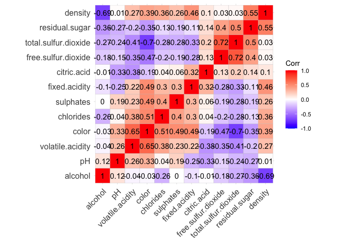
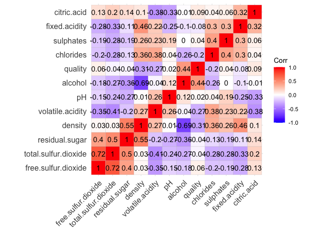
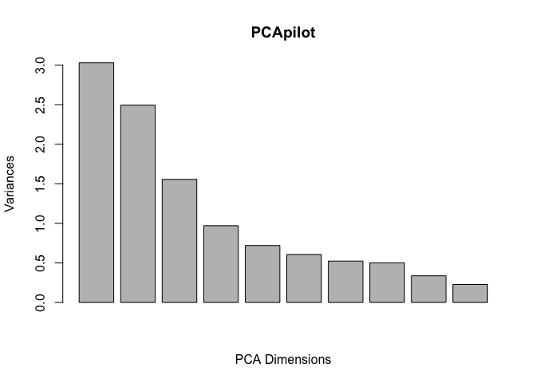
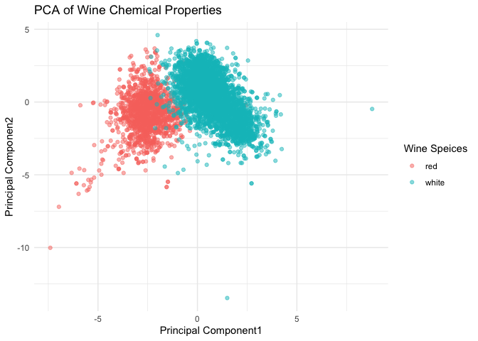
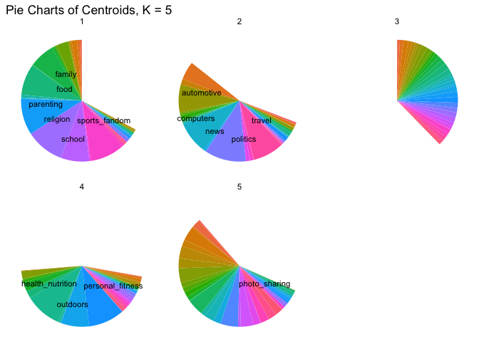
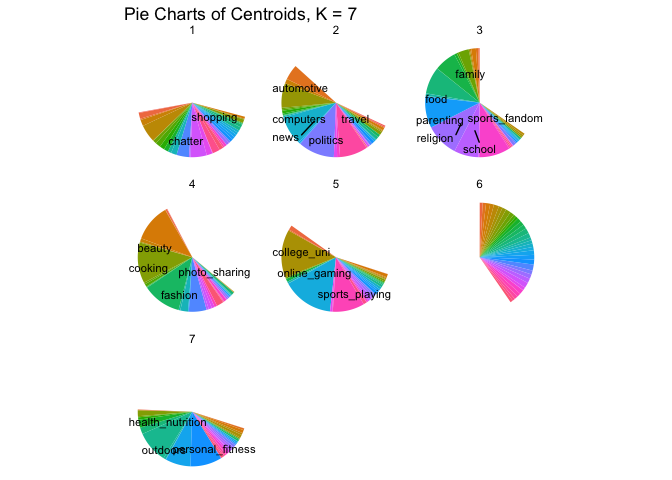
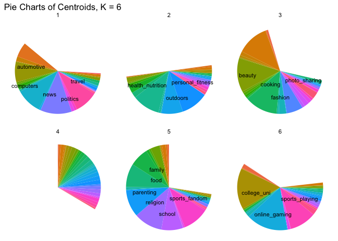
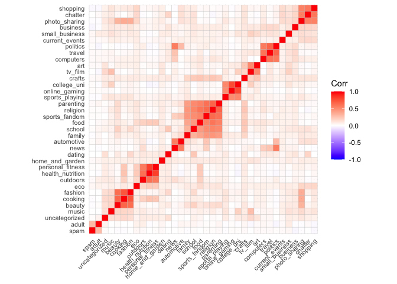
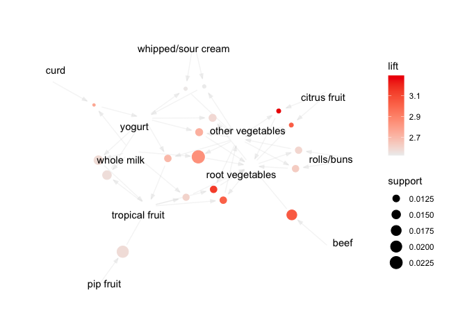

# ECO 395M: StatLearning Exercise 3

Aahil Navroz, Joseph Williams, Qi Suqian

04/22/2023

## Clustering and PCA

## Market segmentation

*Use the data to come up with some interesting, well-supported insights
about the audience and give your client some insight as to how they
might position their brand to maximally appeal to each market segment.*

To get a basic idea of our data lets start with a two-way correlation
plot.

Great! So already we’re seeing some clusters. I notice see two way
correlation within the following groups:

-   group1\_familyvalues: `parenting`, `religion`, `sports_fandom`,
    `food`, `school`, `family`
-   group2\_collegeboy: `college_uni`, `online_gaming`, `sports_playing`
-   group3\_fashionable: `beauty`, `cooking`, `fashion`
-   group4\_yuppie: `personal_fitness`, `health_nutrition`, `outdoors`
-   group5\_neoliberal: `politics`, `travel`, `computers`
-   group6\_socialyte: `shopping`, `chatter`, `photo_sharing`

Lets organize counts to see how many followers had at least two or more
tweets in at least 2, (or 3 for family\_values and socialyte) variables
of each cluster. Lets also filter out users who are in more than 3 of
these respective groups to eliminate generalists and get a better
personality portrait of our followers.

Over 1500 users are in the loosely constructed \`familyvalues’,
‘yuppie’, and ‘socialyte’ groups, respectively. Even with filtering
efforts, however, many users are likely counted 2 or even 3 times.
Before we go farther in this direction, lets shift to machine learning
algorithms so that our clusters are definite and exhaustive. We’ll start
with K-means and K\_means++ clustering with K=5-7 clusters, since we see
6 key groups off the bat. See below visualizations and counts per
cluster.

    ##   Cluster Users
    ## 1       1   740
    ## 2       2   670
    ## 3       3  4172
    ## 4       4   870
    ## 5       5  1430

    ##   Cluster Users
    ## 1       1  1280
    ## 2       2   620
    ## 3       3   706
    ## 4       4   517
    ## 5       5   371
    ## 6       6  3583
    ## 7       7   805

    ##   Cluster Users
    ## 1       1   682
    ## 2       2   888
    ## 3       3   574
    ## 4       4  4545
    ## 5       5   764
    ## 6       6   429

We are able to confirm using unsupervised learning pretty much the same
clusters we identified using intuition and basic tools. Labeled
variables have centroid values over a certain, relatively-high
threshold. Our results use standard K-means but we’ve verified that
results are repeatable with K-means++ start up. Regarding selection of K
we notice the following points:

-   Each K identifies a ‘spam’ category where no variables are dominant.
-   K=5 splits up our ‘fashionable’ and ‘socialyte’ clusters between the
    four non-spam groups, so that the only major feature of one of the
    clusters is `photo_sharing`.  
-   K=6,7 recovers the ‘fashionable’ cluster, and some of the
    ‘socialyte’ cluster. Its likely that the ‘socialyte’ characteristics
    `shopping`, `chatter` and `photo sharing` represent popular uses of
    Twitter which are more easily distributed between users in other
    categories.

Altogether, its clear that K=6 weeds out the most spam posts and
maintains an even distribution between the other categories, a key
requirement of clustering. Most importantly, it aligns incredibly well
with our opening analysis. Next, our key insights will rely on K-means
clustering using K=6 and identify five distinct non-spam groups.

#### Insights & Recommended Steps

We’ve identified 5 roughly even-sized market segments. Here are the two
largest in descending order:

-   **Health-conscious adults (likely mid-twenties to thirties)**. In my
    city we call these yoga enthusiasts and REI shoppers ‘yuppies’,
    short for ‘young professionals’. This market segment shared twitter
    engagement in `health_nutrition`, `personal_fitness`, `outdoors`.
    This segment also showed notable interest for `eco`, though it did
    not meet the display threshold. We recommend an approach that shows
    sustainability efforts, and connects your product to outdoor
    engagement and mental health.

-   **Traditional Americans**. Don’t forget about the heartland, the
    silent majority, your minivan moms and sports bar dads. This market
    segment showed over-threshold engagement with more categories than
    any other group, by far, indicating they are ‘classic American’
    consumers- not part of any niche group. Key characteristics align
    with traditional values, and include `family`, `food`, `religion`,
    `sports fandom`, `school` and `parenting`. To appeal to this group,
    show that your product could easily find its way to a children’s
    soccer game or family reunion.

Overall, to appeal to both groups and maximize market outreach, perhaps
you are the beverage of choice for the modern parent… but not *too*
modern. Perhaps its being consumed on a good ol’ fashioned camping trip.
Don’t forget to put ice in the cooler!

## Association rules for grocery purchases

*Find some interesting association rules for these shopping baskets.
Pick your own thresholds for lift and confidence; just be clear what
these thresholds are and how you picked them. Do your discovered item
sets make sense? Present your discoveries using an interesting
visualization or two, along with no more than one page of typed text.*

We’ll begin with some initial data wrangling in order to view the data.
See below head() for first 5 baskets.

    ##     items                      
    ## [1] {citrus fruit,             
    ##      margarine,                
    ##      ready soups,              
    ##      semi-finished bread}      
    ## [2] {coffee,                   
    ##      tropical fruit,           
    ##      yogurt}                   
    ## [3] {whole milk}               
    ## [4] {cream cheese ,            
    ##      meat spreads,             
    ##      pip fruit,                
    ##      yogurt}                   
    ## [5] {condensed milk,           
    ##      long life bakery product, 
    ##      other vegetables,         
    ##      whole milk}

Next, we’ll initialize association analysis with very low support and
confidence levels and further tuned from there depending on the
distributions we saw while plotting the rules. Based on the spread of
confidence and lift, we changed values in order to find that sweet spot
of confidence which is not too restrictive, and has a lift value which
will enable us to focus on more significant rules. Eventually, I arrived
at the value of 0.01 for support and set confidence to 0.25.

170 is quite a large number for rules in this case. I would like more to
analyze more significant associations so I will only focus on lifts that
are greater than 2.5.

    ##      lhs                                       rhs                support   
    ## [1]  {citrus fruit, other vegetables}       => {root vegetables}  0.01037112
    ## [2]  {other vegetables, tropical fruit}     => {root vegetables}  0.01230300
    ## [3]  {beef}                                 => {root vegetables}  0.01738688
    ## [4]  {citrus fruit, root vegetables}        => {other vegetables} 0.01037112
    ## [5]  {root vegetables, tropical fruit}      => {other vegetables} 0.01230300
    ## [6]  {other vegetables, whole milk}         => {root vegetables}  0.02318251
    ## [7]  {curd, whole milk}                     => {yogurt}           0.01006609
    ## [8]  {other vegetables, yogurt}             => {root vegetables}  0.01291307
    ## [9]  {other vegetables, yogurt}             => {tropical fruit}   0.01230300
    ## [10] {other vegetables, rolls/buns}         => {root vegetables}  0.01220132
    ## [11] {tropical fruit, whole milk}           => {root vegetables}  0.01199797
    ## [12] {rolls/buns, root vegetables}          => {other vegetables} 0.01220132
    ## [13] {root vegetables, yogurt}              => {other vegetables} 0.01291307
    ## [14] {whole milk, yogurt}                   => {tropical fruit}   0.01514997
    ## [15] {pip fruit}                            => {tropical fruit}   0.02043721
    ## [16] {tropical fruit, whole milk}           => {yogurt}           0.01514997
    ## [17] {whipped/sour cream, yogurt}           => {other vegetables} 0.01016777
    ## [18] {other vegetables, whipped/sour cream} => {yogurt}           0.01016777
    ##      confidence coverage   lift     count
    ## [1]  0.3591549  0.02887646 3.295045 102  
    ## [2]  0.3427762  0.03589222 3.144780 121  
    ## [3]  0.3313953  0.05246568 3.040367 171  
    ## [4]  0.5862069  0.01769192 3.029608 102  
    ## [5]  0.5845411  0.02104728 3.020999 121  
    ## [6]  0.3097826  0.07483477 2.842082 228  
    ## [7]  0.3852140  0.02613116 2.761356  99  
    ## [8]  0.2974239  0.04341637 2.728698 127  
    ## [9]  0.2833724  0.04341637 2.700550 121  
    ## [10] 0.2863962  0.04260295 2.627525 120  
    ## [11] 0.2836538  0.04229792 2.602365 118  
    ## [12] 0.5020921  0.02430097 2.594890 120  
    ## [13] 0.5000000  0.02582613 2.584078 127  
    ## [14] 0.2704174  0.05602440 2.577089 149  
    ## [15] 0.2701613  0.07564820 2.574648 201  
    ## [16] 0.3581731  0.04229792 2.567516 149  
    ## [17] 0.4901961  0.02074225 2.533410 100  
    ## [18] 0.3521127  0.02887646 2.524073 100

Looking at the rules sorted by lift, many of these item sets make
intuitive sense in the context of a grocery store. Many of these sets
are plausible combinations that I can see myself and others buying at a
grocery store. Observing the first rule, we can see citrus fruit, other
vegetables, and root vegetables being bought together, which is common
behavior when purchasing fresh produce. The most significant but simple
rule using lift as a metric is beef and root vegetables: two parts of a
full meal!

Here is a graphical representation of rules based on our chosen support,
confidence, and lift levels filtered to above 2.5.

## Image classification with neural networks
