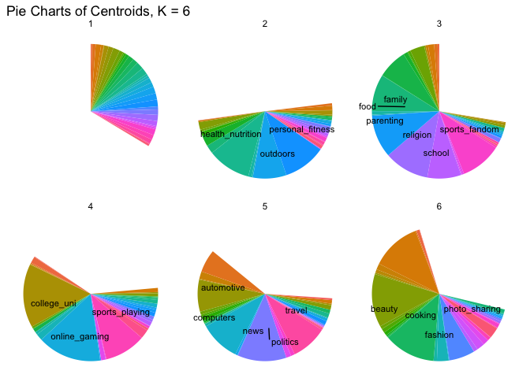

# ECO 395M: StatLearning Exercise 3

Aahil Navroz, Joseph Williams, Qi Suqian

04/22/2023

## Clustering and PCA

*Run both PCA and a clustering algorithm of your choice on the 11
chemical properties (or suitable transformations thereof) and summarize
your results. Convince yourself (and me) that your chosen method is
easily capable of distinguishing the reds from the whites. Does your
unsupervised technique also seem capable of distinguishing the higher
from the lower quality wines?*

We first performed a preliminary analysis on the chemical properties. We
plot the correlation matrix using color and quality. According to the
plot, `total.sulfur.dioxide`, `volatile.acidity` and `chlorides` are the
3 most related variables to color and `alcohol` is the most related
variable to `quality`.

Next, we run PCA on the 11 chemical properties and show the PCA variance
plot. We choose to decrease the data dimension to 4, which means we
choose the first 4 PCA components. We then show the unit vector of these
4 PCA components.

    ## Importance of first k=4 (out of 11) components:
    ##                           PC1    PC2    PC3     PC4
    ## Standard deviation     1.7407 1.5792 1.2475 0.98517
    ## Proportion of Variance 0.2754 0.2267 0.1415 0.08823
    ## Cumulative Proportion  0.2754 0.5021 0.6436 0.73187

    ##                        PC1   PC2   PC3   PC4
    ## fixed.acidity        -0.24 -0.34 -0.43  0.16
    ## volatile.acidity     -0.38 -0.12  0.31  0.21
    ## citric.acid           0.15 -0.18 -0.59 -0.26
    ## residual.sugar        0.35 -0.33  0.16  0.17
    ## chlorides            -0.29 -0.32  0.02 -0.24
    ## free.sulfur.dioxide   0.43 -0.07  0.13 -0.36
    ## total.sulfur.dioxide  0.49 -0.09  0.11 -0.21
    ## density              -0.04 -0.58  0.18  0.07
    ## pH                   -0.22  0.16  0.46 -0.41
    ## sulphates            -0.29 -0.19 -0.07 -0.64
    ## alcohol              -0.11  0.47 -0.26 -0.11

Now we plot the wine color data to PC1 and PC2. From all the combination
of PC components, PC1 and PC2 best distinguish red wine from white wine.

We move on to K-means clustering algorithms. We chose to cluster the
data into two subsets. The below confusion matrix shows 98.58% accuracy.
Altogether, we conclude that both PCA analysis and K-means clustering
are similarly effective in predicting wine color.

    ##           Cluster_Label
    ## True_Color  red white
    ##      red   1575    24
    ##      white   68  4830

    ## [1] 0.9858396

Next we try to use PCA to distinguish the wine quality. The plot shows
that PCA method doesn’t perform well and it’s hard to visually
distinguish wines of different color using any combination of PCA
factors. We also made a 3D plot for better visualization (see Rmd). Both
plots showed that PCA performs badly for wine quality.

Now we check the performance of K-means for wine quality. The accuracy
is only 15%, which is also very bad. As a result, both methods do not
seem capable of predicting wine quality.

    ##           Cluster_Label
    ## True_Color   3   4   5   6   7   8   9
    ##          3   5   6   7   4   2   3   3
    ##          4  63  64  24  15   2  26  22
    ##          5 457 469 649 197  27 263  76
    ##          6 533 346 640 263  16 480 558
    ##          7 131  43 122 140   2 191 450
    ##          8  25   2  22  14   0  32  98
    ##          9   1   0   0   0   0   0   4

    ## [1] 0.1568416

## Market segmentation

*Use the data to come up with some interesting, well-supported insights
about the audience and give your client some insight as to how they
might position their brand to maximally appeal to each market segment.*

To get a basic idea of our data lets start with a two-way correlation
plot.

Great! So already we’re seeing some clusters. I notice see two way
correlation within the following groups:

-   group1\_familyvalues: `parenting`, `religion`, `sports_fandom`,
    `food`, `school`, `family`
-   group2\_collegeboy: `college_uni`, `online_gaming`, `sports_playing`
-   group3\_fashionable: `beauty`, `cooking`, `fashion`
-   group4\_yuppie: `personal_fitness`, `health_nutrition`, `outdoors`
-   group5\_neoliberal: `politics`, `travel`, `computers`
-   group6\_socialyte: `shopping`, `chatter`, `photo_sharing`

Lets organize counts to see how many followers had at least two or more
tweets in at least 2, (or 3 for family\_values and socialyte) variables
of each cluster. Lets also filter out users who are in more than 3 of
these respective groups to eliminate generalists and get a better
personality portrait of our followers.

    ## # A tibble: 6 × 2
    ##   group               user_count
    ##   <chr>                    <dbl>
    ## 1 group1_familyvalues       1518
    ## 2 group2_collegeboy         1036
    ## 3 group3_fashionable        1211
    ## 4 group4_yuppie             1766
    ## 5 group5_neoliberal         1285
    ## 6 group6_socialyte          1820

Over 1500 users are in the loosely constructed \`familyvalues’,
‘yuppie’, and ‘socialyte’ groups, respectively. Even with filtering
efforts, however, many users are likely counted 2 or even 3 times.
Before we go farther in this direction, lets shift to machine learning
algorithms so that our clusters are definite and exhaustive. We’ll start
with K-means and K\_means++ clustering with K=5-7 clusters, since we see
6 key groups off the bat. See below visualizations and counts for K=6
cluster, which showed the most evenly distributed and sensible results.

    ##   Cluster Users
    ## 1       1  4539
    ## 2       2   889
    ## 3       3   759
    ## 4       4   439
    ## 5       5   682
    ## 6       6   574

We are able to confirm using unsupervised learning pretty much the same
clusters we identified using intuition and basic tools. Our K=6
clustering also weeds out a large number of spam posts (see the unlabled
wedge, which also has the most users). Labeled variables have centroid
values over a certain, relatively-high threshold. Our results use
standard K-means but we’ve verified that results are repeatable with
K-means++ start up.

#### Insights & Recommended Steps

We’ve identified 5 roughly even-sized market segments using K-means
clustering with K=6. Here are the two largest in descending order:

-   **Health-conscious adults (likely mid-twenties to thirties)**. In my
    city we call these yoga enthusiasts and REI shoppers ‘yuppies’,
    short for ‘young professionals’. This market segment shared twitter
    engagement in `health_nutrition`, `personal_fitness`, `outdoors`.
    This segment also showed notable interest for `eco`, though it did
    not meet the display threshold. We recommend an approach that shows
    sustainability efforts, and connects your product to outdoor
    engagement and mental health.

-   **Traditional Americans**. Don’t forget about the heartland, the
    silent majority, your minivan moms and sports bar dads. This market
    segment showed over-threshold engagement with more categories than
    any other group, by far, indicating they are ‘classic American’
    consumers- not part of any niche group. Key characteristics align
    with traditional values, and include `family`, `food`, `religion`,
    `sports fandom`, `school` and `parenting`. To appeal to this group,
    show that your product could easily find its way to a children’s
    soccer game or family reunion.

Overall, to appeal to both groups and maximize market outreach, perhaps
you are the beverage of choice for the modern parent… but not *too*
modern. Perhaps its being consumed on a good ol’ fashioned camping trip.
Don’t forget to put ice in the cooler!

## Association rules for grocery purchases

*Find some interesting association rules for these shopping baskets.
Pick your own thresholds for lift and confidence; just be clear what
these thresholds are and how you picked them. Do your discovered item
sets make sense? Present your discoveries using an interesting
visualization or two, along with no more than one page of typed text.*

We’ll begin with some initial data wrangling in order to view the data.
See below head() for first 5 baskets.

    ##     items                      
    ## [1] {citrus fruit,             
    ##      margarine,                
    ##      ready soups,              
    ##      semi-finished bread}      
    ## [2] {coffee,                   
    ##      tropical fruit,           
    ##      yogurt}                   
    ## [3] {whole milk}               
    ## [4] {cream cheese ,            
    ##      meat spreads,             
    ##      pip fruit,                
    ##      yogurt}                   
    ## [5] {condensed milk,           
    ##      long life bakery product, 
    ##      other vegetables,         
    ##      whole milk}

Next, we’ll initialize association analysis with very low support and
confidence levels and tune from there depending on distributions we see
when plotting the rules.

Based on spread of confidence and lift, we tweaked ‘supp’, ‘conf’ and
‘minlen’ parameters to find a sweet spot where confidence is not too
restrictive but there is enough variation in lift to identify the most
significant associations. Eventually, we arrived at parameter values of
0.01 for support and 0.25 for confidence.

170 is quite a large number for rules in this case. Lets only focus on
lifts that are greater than 2.5 in order to analyze only significant
associations.

    ##      lhs                                       rhs                support confidence coverage lift  count
    ## [1]  {citrus fruit, other vegetables}       => {root vegetables}  0.010   0.359      0.029    3.295 102  
    ## [2]  {other vegetables, tropical fruit}     => {root vegetables}  0.012   0.343      0.036    3.145 121  
    ## [3]  {beef}                                 => {root vegetables}  0.017   0.331      0.052    3.040 171  
    ## [4]  {citrus fruit, root vegetables}        => {other vegetables} 0.010   0.586      0.018    3.030 102  
    ## [5]  {root vegetables, tropical fruit}      => {other vegetables} 0.012   0.585      0.021    3.021 121  
    ## [6]  {other vegetables, whole milk}         => {root vegetables}  0.023   0.310      0.075    2.842 228  
    ## [7]  {curd, whole milk}                     => {yogurt}           0.010   0.385      0.026    2.761  99  
    ## [8]  {other vegetables, yogurt}             => {root vegetables}  0.013   0.297      0.043    2.729 127  
    ## [9]  {other vegetables, yogurt}             => {tropical fruit}   0.012   0.283      0.043    2.701 121  
    ## [10] {other vegetables, rolls/buns}         => {root vegetables}  0.012   0.286      0.043    2.628 120  
    ## [11] {tropical fruit, whole milk}           => {root vegetables}  0.012   0.284      0.042    2.602 118  
    ## [12] {rolls/buns, root vegetables}          => {other vegetables} 0.012   0.502      0.024    2.595 120  
    ## [13] {root vegetables, yogurt}              => {other vegetables} 0.013   0.500      0.026    2.584 127  
    ## [14] {whole milk, yogurt}                   => {tropical fruit}   0.015   0.270      0.056    2.577 149  
    ## [15] {pip fruit}                            => {tropical fruit}   0.020   0.270      0.076    2.575 201  
    ## [16] {tropical fruit, whole milk}           => {yogurt}           0.015   0.358      0.042    2.568 149  
    ## [17] {whipped/sour cream, yogurt}           => {other vegetables} 0.010   0.490      0.021    2.533 100  
    ## [18] {other vegetables, whipped/sour cream} => {yogurt}           0.010   0.352      0.029    2.524 100

Looking at the rules sorted by lift, many of these item sets make
intuitive sense in the context of a grocery store. Many of these sets
are plausible combinations that I can see myself and others buying at a
grocery store. Observing the first rule, we can see citrus fruit, other
vegetables, and root vegetables being bought together, which is common
behavior when purchasing fresh produce. The most significant but simple
rule using lift as a metric is beef and root vegetables: two parts of a
full meal!

Here is a graphical representation of rules based on our chosen support,
confidence, and lift levels filtered to above 2.5.

## Image classification with neural networks

Our write up for this question is stored in the hw4\_jupyter folder.
Please run the hw4q4.ipynb file as you would. You may need to change
‘python3’ to ‘python’, ‘pip3’ to ‘pip’ or vice versa. Please reach out
if the code is not working!
